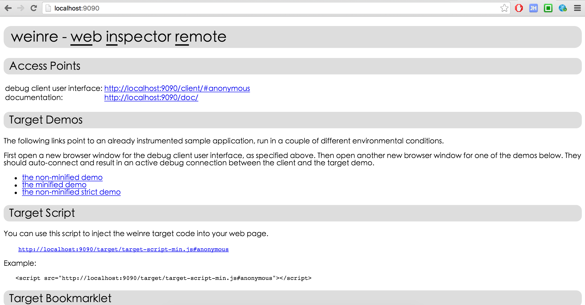
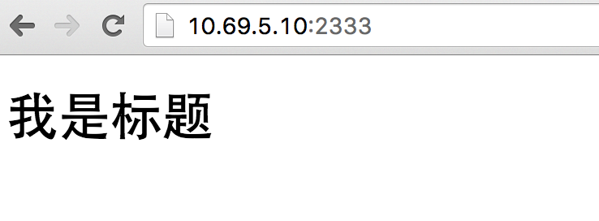
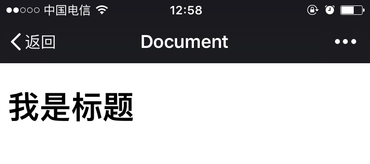
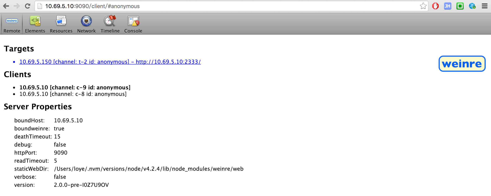
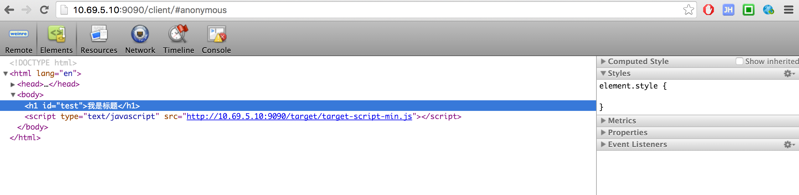
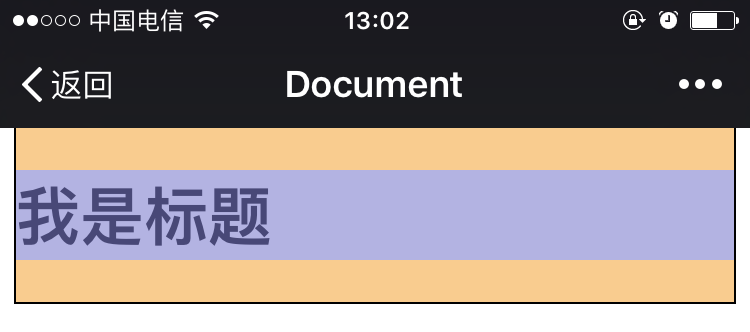

手机页面的调试
==================
#### UC浏览器开发版（仅限安卓平台）
> 超级强大，昨天用春鹏的手机试了下，样式、脚本、资源，都可以调试，而且UC在移动端份额最大，针对性很高。

1、 [UC浏览器开发版](http://plus.uc.cn/document/webapp/doc5.html)

2、 官方的文档已经很详细了，包括两种调试方法，无线和有线。有线的调试很复杂，需要ADB工具，需要数据线，所以还是直接无线调试比较好。

3、 无线调试方法简记：

* 安卓手机安装UC浏览器的开发版
* 保证手机和电脑在同一个局域网
* 记录下手机的ip地址，比如手机ip为 `10.69.5.150`
* 在UC浏览器中打开需要调试的页面
* 电脑上打开 `10.69.5.150:9998` 即可开始开心的调试（和chrome控制台相差不大）


#### weinre本地服务器（全平台）
> weinre是专门的网页调试工具，它会在本地创建一个监听服务器，然后你需要在被调试页面插入一个它提供的js，然后weinre就可以监听到，然后即可开始调试。

1、 [weinre官网](http://people.apache.org/~pmuellr/weinre/)

2、 [weinre npm](https://www.npmjs.com/package/weinre)

3、 调试步骤

* 本地全局安装weinre

```
npm install weinre -g
```

* 启动本地 weinre 服务

```
weinre --boundHost 10.69.5.10 --httpPort 9090
```

* 参数解释

```
--boundHost 10.69.5.10 : 在你局域网的地址开启服务

--httpPort 9090 : 本地服务器监听端口，不设置默认为8080
```

* 访问pc调试界面
如果启动服务时指定了ip和端口，访问此ip的指定端口即可。
本例地址为： `http://10.69.5.10:9090/`

* 在调试页面插入监听脚本
在调试页面中插入下图中 Target Script 中的js，本例即 `http://10.69.5.10:9090/target/target-script-min.js#anonymous`。
`#anonymous` 这个是页面标志，不同的标志在选取目标调试页时可以起到识别作用。

假设页面代码如下
```
<!DOCTYPE html>
<html lang="en">
<head>
	<meta charset="UTF-8">
	<meta name="viewport" content="width=device-width, initial-scale=1.0, maximum-scale=1.0, minimum-scale=1.0, user-scalable=no, minimal-ui">
	<meta name="format-detection" content="telephone=no">
	<title>Document</title>
</head>
<body>

<h1 id="test">我是标题</h1>

<script type="text/javascript" src="http://10.69.5.10:9090/target/target-script-min.js"></script>

</body>
</html>
```

* 在终端访问此页面（apache可以直接有个本地http服务，nodejs需要自己启一个）
```
// 在本地的2333端口开启服务，返回上面的测试页
'use strict';
var express = require('express');
var app = express();
var pwd = __dirname;
var port = 2333;
app.get('/', function(req, res, next) {
    res.sendFile(pwd + '/test.html')
})
app.listen(2333);
```
此时访问 `10.69.5.10::2333` 就可以看到上面测试页的内容


然后在局域网的其它终端访问此页面都可以看到


此时打开 `http://10.69.5.10:9090/client/` 你会看到


选中 Targets 里的地址即可开始调试，如下图



4、其它

weinre最大的缺点就是不能调试js，虽然它实现了一个简单的js解释器，能在自己的控制台操作dom，但是本身页面里的调试信息没法在这捕获，遗憾。  
但是它支持全平台，不管是wap还是app，只要是前端的html页面，都可以调试，遇到一些奇葩的兼容性问题很好找。  
如果真心用这个工具，我们还可以在测试服务器搭一个代理服务，任何线上页面走这个代理服务器，都会被注入那段监听的js，测试机访问代理服务器吐出的地址，pc机访问统一的控制台页面，本地什么配置都不用，就可以开始真机调试。  
再深入的话也可以深究一下weinre的js调试问题，那就圆满了。。。脑洞ing。。。  
