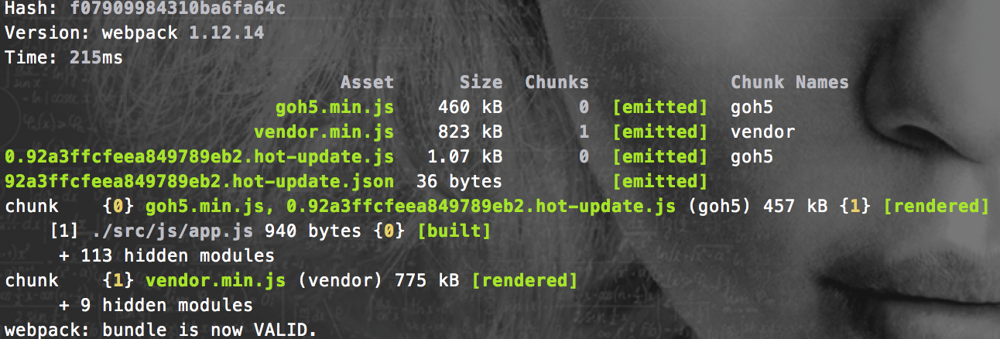

基于 webpack 的 workflow 
=================================

## 前端工作流中要解决的问题

* 资源管理：模块化、组件化、依赖管理等
* 开发流程：dev、debug、proxy、build、deploy
* 周边工具：图形化界面、命令行辅助、自动化工程

## 简介

* [webpack官网](http://webpack.github.io/)  
* Webpack 是当下最热门的前端资源模块化管理和打包工具。它  
	* 能把散碎的静态资源通过一定的规则打包在一起  
	* 还可以require几乎所有的静态资源，包括但不限于CommonJs 模块、 AMD 模块、 ES6 模块、CSS、图片、 JSON、Coffeescript、 LESS、 Vue、 Jade、Ejs 等等  
	* 还可以将代码切割成不同的chunk，实现按需加载，异步加载
	* 还可以极精细的控制所有静态资源的版本  
	* 还可以实现代码热替换，开发模式下，不用刷新浏览器，不用实时编译，自身的socket-io已经把内存中的代码换成最新的  
	* 还可以 `SourceUrls` 和 `SourceMaps`，易于调试
	* 还可以和前端最新的技术栈完美融合（Vue、React），针对这两个在webpack中有一整套的工具链  
	* 还可以使用 `Plugin` 插件，实现各种定制化任务  
	* 还可以和 `gulp/grunt` 等构建工具协同作战，完成极其复杂的任务  
	* 还原生支持增量编译，发布代码再也不用等个好几分钟  

## 资源管理

* ### 模块化

用 `webpack` 来做模块化，简直神器。  

前端的模块化一直是一个很受人关注的问题，不同的加载器实现方式都不一样。`lithe/requireJs/seaJs`，这样的预加载器都有自己的一套实现方式，一定程度上解决了js的模块化问题，但是不同的实现方式，让我们不得不对不同的库做兼容性处理，让加载器能够识别，无疑增加了工作量和降低了模块的通用度。即使现在ES6提出了统一的标准，但是离实际使用还有很长的距离。  

所以，有一个足够灵活，足够强大的模块加载器是个必要的选择。

在 `webpack` 中，同时支持 CommonJS、AMD和ES6，灵活性有保证。  
并且在 `webpack` 的设计理念中，所有的静态资源都是模块，所以借助强大的 `loader` 系统几乎可以加载任意类型的静态资源，并且对模块的输出结果可以做非常精细的控制，根据不同的配置可以达到任意想要的结果。  

```
loaders: [{
    test: /.js$/,
    loader: 'jsx-loader?harmony'
}, {
    test: /.vue$/,
    loader: 'vue-loader'
},{
    test: /.css$/,
    loader: 'style-loader'
},{
	test: /\.(jpe?g|png|gif|svg)$/i,
	loaders: [
	    'image?{bypassOnDebug: true, progressive:true, optimizationLevel: 3, pngquant:{quality: "65-80"}}',
	    'url?limit=10000&name=img/[hash:8].[name].[ext]',
	]
}]
```

这是 `webpack` 配置文件中的 `loaders` 部分，其中，`test` 是正则匹配，匹配到的文件将使用相应的 `loader` 去解析，然后这些文件就成为了模块，可以在其它地方引用。比如：  

```
// a.js
// 加载js
var login = require('./src/js/conf/login/login.js');

// js文件会被webpack包装，并赋予单独ID，exports出去

// 加载css
require('./src/css/login.css');

// css文件会被以style标签插入到head中，当然，也可以通过ExtractTextPlugin这样的插件以link标签插入到页面中

// 加载图片
var btnImg = require('./src/img/btn.png');
var img = document.createElement('img');
img.src = btnImg;

// 根据上面的配置，小于10k的图片直接dataurl到src中，并且打包后自动添加hash值，当然，在js中引用，hash值部分也相应的会变化。

// 加载vue单文件组件
var loginCom = require('./src/js/components/login.vue');

// vue有单独的loader读取vue单文件组件

// 所有模块的加载可以做很多灵活的配置，比如，文件hash值、小于一定大小的图片dataurl、打包后文件命名等
// jade模版，ejs模版，less文件，sass文件都可以直接require，不用预编译，直接用！

```

* ### 组件化  

抛开现在流行的组件化解决方案，光以 `webpack` 的角度来看，如果模版，样式，脚本，都可以作为模块来引入，这就使得封装组件变的很简单。比如：  

```
// 搜索组件
// js/component/search/index.js

require('js/component/search/index.css');

var tpl = require('js/component/search/template.ejs');
var htmlStr = tpl({searchContent: options.searchStr});

var launchSearch = function(options){}

module.exports = {
	launchSearch: launchSearch,
	somethingelse: 'balabala'
};
```

使用：  
```
// js/app.js
var searchComponent = require('js/component/search/index.js');

var options = {
	searchStr: '水果'
	// ...
}
searchComponent.launchSearch(options);
```
这样的开发方式无疑能够极大降低维护成本，当然，如果和现在流行的前端框架，如React、Vue结合起来实现组件化，代码组织会更加清晰，自由度也更高，展开讲又是一个大话题，按下不表。

还是贴一下伪代码吧。。以 `Vue` 为例  
```
// alert.vue

<template>
    <div class="alert" v-show="alertConfig.show" :class="alertConfig.type" transition="fade">
        <h4>{{alertConfig.msg}}</h4>
    </div>
</template>
<style>
// css 样式
</style>
<script>
var Vue = require('Vue');

var Alert = Vue.extend({
    name: 'Alert',
    prop: ['alertConfig']
})

module.exports = Alert;
</script>
```

使用
```
// main.vue（同样是一个组件，可能被其它组件（如根组件）依赖）

<templeate>
	<m-alert :alert-config="alertConfig"></m-alert>
</template>
<script>
var Vue = require('Vue');

var Alert = require('alert.vue');

var Main = Vue.extend({
    name: 'Main',
    data: function(){
    	return {
    		alertConfig: {
    			show: false,
    			type: 'info', // info/success/warning/erro
    			msg: '提示信息'
    		}
    	}
    },
    components: {
    	'm-alert': Alert
    }
})

module.exports = Main;
</script>
```
这样的 `.vue` 组件通过 `webpack` 中的 `vue-loader` 插件就可以完成打包。

* ### 依赖管理

没有什么好说的。。。`npm`。  
毕竟绝大部分的流行库都在 `npm` 上，也都支持模块加载的方式。不排除有一些纯js库（jq插件）需要手动封装下。其实也很简单，如果都遵循 `CommonJs` 的加载方式，而且其中没有其它依赖的话，直接 `require` 即可，如果有依赖，大部分也是 `jq` 等，在文件最前面声明下 `var $ = require('jQuery')` 即可。  
这样，一个工程只需要维护一份 `package.json` ，不管是开发用的包，还是构建用的包都可以统一管理。  


## 开发流程

对于前端的开发流程，一直的想法是，我们能有一个统一的入口工具，不管是命令行还是图形化界面，可以把调试，代理，构建等一系列操作整合起来，并且尽可能的简化这样的操作，开发不用过多的关注构建问题，也不用为调试、构建浪费更多的精力。

* ### dev、debug

基于 `webpack` 的开发流程主要有两种方式：

* `webpack` 的实时构建模式

	`webpack --watch` 每次修改代码都会实时的构建，增量的，很快，即使是用了 `uglify` 实时构建压缩也很快（不超过1s）

* `webpack-dev-server`

	`webpack-dev-server` 是一个小型的 `express` 服务器，它的原理就是使用 `webpack-dev-middleware` 中间件来为通过 `webpack` 生成的静态资源提供web服务。它的内部通过 `socket.io` 连接客户端，可以实时发送编译状态的信息到客户端，从而达到客户端代码的实时热更新，也就是 `HMR` `Hot Module Replacement`。

	`webpack-dev-server` 支持命令行模式和 `NodeJs` 模式，命令行模式就是直接打开 `webpack-dev-server` 本地服务器，参数默认，配置灵活性稍低，但是简单快捷，如下：  

	```
	// --line 行内模式 | --hot 热替换
	webpack-dev-server --line --hot
	```

	在项目根目录行执行上面的命令之后，本地的 `webpack-dev-server` 服务器已经启动，此目录下的由 `webpack` 生成的静态资源都将被这个本地服务器托管。  

	以 GoH5 为例，把页面内引用的资源改为 `8080` 端口下对应的文件并加入 `http://localhost:8080/webpack-dev-server.js`，此时代码热更新已经生效：  

	```
	<!DOCTYPE html>
	<html>

	<head>
	    <meta charset="utf-8">
	    <meta name="description" content="GoH5，一款可视化的H5编辑器，拖拽、动画、事件，神奇的H5。">
	    <meta name="keywords" content="H5,可视化,cms,编辑器">
	    <meta name="viewport" content="width=device-width, initial-scale=1.0">
	    <meta name="renderer" content="webkit">
	    <title>Go H5</title>
	    <link rel="stylesheet" type="text/css" href="/back/dist/css/goh5.min.css?ver=1.0.3"/>
	</head>

	<body>
	    <div id="app">
	        <router-view></router-view>
	    </div>
	    <script src="http://localhost:8080/webpack-dev-server.js"></script>
	    <script type="text/javascript" src="http://localhost:8080/vendor.min.js?ver=1.0.3"></script>
	    <script type="text/javascript" src="http://localhost:8080/goh5.min.js?ver=1.0.3"></script>
	</body>

	</html>

	// 因为我的应用服务启动在 3030 端口，所以这里的地址写了绝对地址，如果同端口，直接写文件名即可
	```

	在控制台可以看到  

	```
	[HMR] Vue component hot reload shim applied. // 不同的热重载提示信息不同（Vue/React）
	[WDS] Hot Module Replacement enabled.
	```

	如果本地修改了代码可以看到  
	```
	[WDS] App updated. Recompiling...
	[WDS] App hot update...
	```
	同时，控制台也会输出相关的编译信息：  

	

	一个字。。。快。。。而且，浏览器并不用刷新呀 (有一定限定条件，并不是一切代码都可以热重载)  

	放一张官网的gif  

	

	上面的例子主要集中在Vue上，其实大同小异，并且 `webpack` 提供了 `webpack-dev-middleware` 中间件，可以定制一个本地的服务，完成很多任务。

	#### **所以我觉得，前端的开发流程如果有一个统一的本地服务，可能性无极限。**

* ### proxy

	线上代码的代理调试，借助 `host`，借助 `Fiddler`，借助 `wamp`，其实。。  

	```
	// webpack.config.js
	{
	    devServer: {
	        proxy: {
	            '/some/path*': {
	                target: 'https://js.meixincdn.com',
	                secure: false,
	            },
	        },
	    },
	}
	```

	当然，这样的代理不够灵活，而且不能代理html，但是如果借助本地的服务，我们可以这么做   

	```
	// 先行配置host，可以手动，也可以像 `fd-server` 有个图形化界面，然后  
	var koa = require('koa');
	var proxy = require('koa-proxy');

	var app = koa();

	app.use(proxy({
	  	host: 'https://localhost:8080/',
	  	match: /\/js.meixincdn.com\//
	}));
	```

	上面达到的功能就是把 `js.meixincdn.com` 域名的资源转发到 `webpack-dev-server` ，然后就可以愉快的开始开发了  


* ### build、deploy

	这一块我的想法还是，放到测试机上去。。  

	测试机上可以跑一个 `gulp watch` 和 `webpack --watch` 的任务，本地提交了 `src` 目录下的文件，测试机检测到文件更新，直接编译，这样的编译都是增量的，肯定很快，然后再该怎么上线怎么上线，怎么发布怎么发布。本地就可以直接忽略 `dist` 目录的改变，不提交其中的内容。  

	还有一点，我是觉得 php 的 smarty 模版可以前端维护，就算不行，静态资源那一块也一定前端维护，这样不管是改时间戳还是直接hash，都很灵活啊～  

## 周边工具
	图形化界面、命令行辅助、自动化工程，高大上的整套解决方案，想想就激动。。。  
